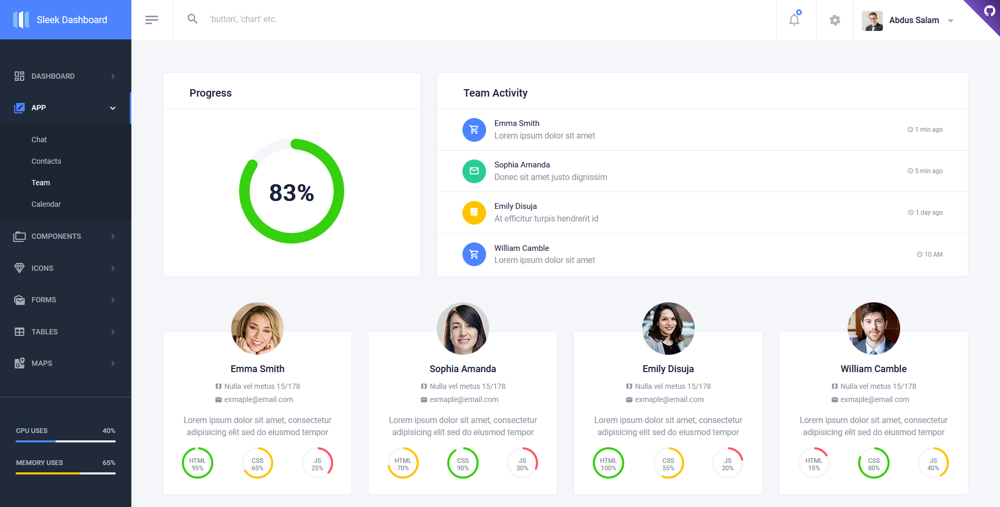

<div align="center">

# Sleek - Free Bootstrap Dashboard

[](https://github.com/themefisher/sleek/stargazers)
[](https://github.com/themefisher/sleek/network)
[]()
<a href="https://coveralls.io/github/chartjs/Chart.js?branch=master"></a>
<a href="https://github.com/chartjs/awesome"></a>


</div>

**Sleek Dashboard** - Free Bootstrap 4 Admin Dashboard Template and UI Kit. It is a very powerful _bootstrap_* admin dashboard, which allows you to build products like admin panels, content management systems and CRMs.
[Bootstrap](https://getbootstrap.com/) is the world's most popular front-end component library for developing with HTML, CSS, and JS. It is an open-source, intuitive, and powerful front-end framework for faster and easier web development.

We are very excited to share this dashboard with you and we look forward to hearing your feedback!

## Table of Contents

- [Demo](#demo)
- [Quick Start](#quick-start)
- [Contribution](#contribution)
- [Plugins](#plugins)
- [Browser Support](#browser-support)
- [Reporting Issues](#reporting-issues)
- [Technical Support or Questions](#technical-support-or-questions)
- [License](#license)

## Demo

| Ecommerce Page  | Analytics Page  | Chat App  |
|---|---|---|
| [](https://demo.themefisher.com/sleek/)  | [](https://demo.themefisher.com/sleek/analytics.html) | [](https://demo.themefisher.com/sleek/chat.html)

| Contacts App  | Team App  | Calendar App  |
|---|---|---|
| [](https://demo.themefisher.com/sleek/contacts.html)  | [](https://demo.themefisher.com/sleek/team.html) | [](https://demo.themefisher.com/sleek/calendar.html)

[View More](https://demo.themefisher.com/sleek/)

## Quick Start

Please visit [Documentation](https://demo.themefisher.com/sleek/quick-start.html) for more detailed information.

### Option 1: From CDN

```
<link href="https://unpkg.com/sleek-dashboard/dist/assets/css/sleek.min.css" rel="stylesheet"/>
```

```
<script src="https://unpkg.com/sleek-dashboard/dist/assets/js/sleek.bundle.js"></script>
```

[View Codepen Example](https://codepen.io/iamabdus/pen/rNavojp/)

### Option 2: From NPM

Install **Sleek Dashboard** from npm

```
npm i sleek-dashboard --save
```

### Option 3: Download

You can download ready to use **Sleek Dashboard** admin template from our [Latest Release](https://github.com/themefisher/sleek/releases)

Please visit [Documentation](https://demo.themefisher.com/sleek/quick-start.html) for more detailed information.

## Contribution

To use our build system and run the project locally follow these instructions -

- Install [Node.js and NPM](https://nodejs.org)
- Install [Ruby](https://www.ruby-lang.org/en/documentation/installation/) then install [Bundler](https://bundler.io/) with `gem install bundler`

- Clone GitHub repository with

  ```
  git clone https://github.com/themefisher/sleek.git
  ```

- Navigate to the root `/sleek-dashboard` directory and Install dependency with

  ```
  npm install
  bundle install
  ```

- Finally run `npm start` and open [http://localhost:4000](http://localhost:4000) in your browser. Now you are ready to hack!

 **Note:** For Windows Read [this guide](https://jekyllrb.com/docs/windows/) to get Jekyll up and running without problems.

## Plugins

- Bootstrap - <http://getbootstrap.com>
- Chart.js -  <http://www.chartjs.org/>
- Select 2 -  <https://select2.org/>
- Simple Bar -  <https://grsmto.github.io/simplebar/>

[See All Plugins](https://demo.themefisher.com/sleek/introduction.html)

## Browser Support

At present, we officially aim to support the following browsers:

    

## Reporting Issues

We use GitHub Issues as the official bug tracker for the **Sleek Dashboard**. Please Search [existing issues](https://github.com/themefisher/sleek/issues). It’s possible someone has already reported the same problem.
If your problem or idea is not addressed yet, [open a new issue](https://github.com/themefisher/sleek/issues)

## Technical Support or Questions

If you have questions or need help integrating the product please [contact us](mailto:hello@tafcoder.com) instead of opening an issue.

<!-- licence -->
## License

Copyright (c) 2016 - Present, Designed & Developed by [Themefisher](https://themefisher.com)

**Code License:** Released under the [MIT](https://github.com/themefisher/sllek/blob/main/LICENSE) license.

**Image license:** The images are only for demonstration purposes. They have their license, we don't have permission to share those images.
