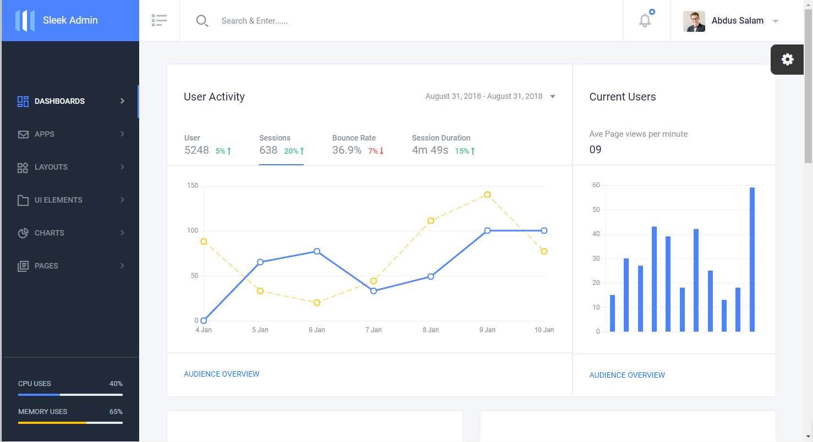
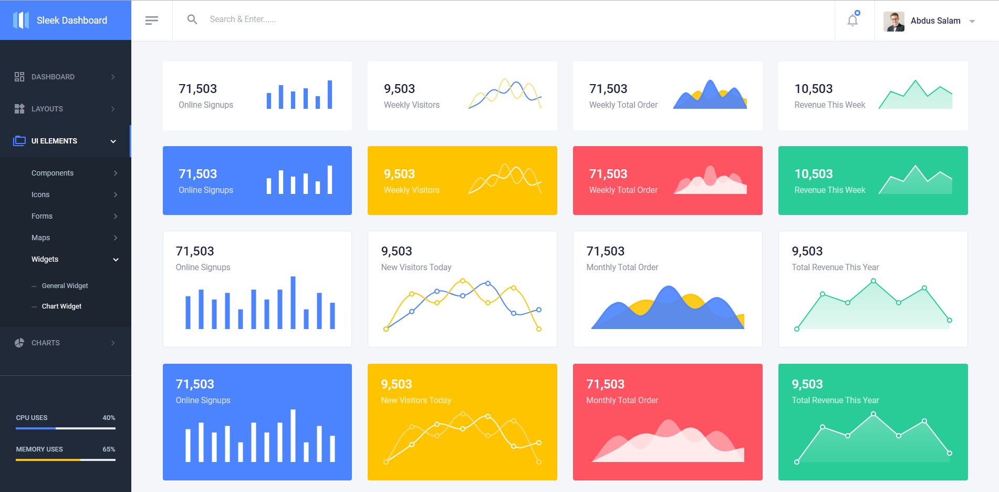

<div align="center">

# <a href="https://sleek.tafcoder.com/" target="_blank" rel="noopener noreferrer">Sleek Dashboard</a> [](https://twitter.com/intent/tweet?text=Wow:&url=https%3A%2F%2Fgithub.com%2Ftafcoder%2Fsleek-dashboard)

</div>

<div align="center">

[](https://github.com/tafcoder/sleek-dashboard/stargazers)
[](https://github.com/tafcoder/sleek-dashboard/issues) 
[]() 
[](https://github.com/tafcoder/sleek-dashboard/network)


</div>

<div align="center">


</div>

`Sleek Dashboard` - Free Bootstrap 4 Admin Dashboard Template and UI Kit. It is very powerful bootstrap admin dashboard, which allows you to build products like admin panels, content managements systems and CRMs.

Bootstrap is world's most popular front-end component library for developing with HTML, CSS, and JS. It is open source, sleek, intuitive, and powerful front-end framework for faster and easier web development. [Bootstrap](https://getbootstrap.com/).

We are very excited to share this dashboard with you and we look forward to hearing your feedback!


## Table of Contents

- [Demo](#demo)
- [Npm Install](#npm-install)
- [Development](#development)
- [File Structure](#file-structure)
- [Browser Support](#browser-support)
- [Reporting Issues](#reporting-issues)
- [Technical Support or Questions](#technical-support-or-questions)
- [Licensing](#licensing)

## Demo

| Ecommerce  | Analytics  | Chart Widgets  | General Widgets  |
|---|---|---|---|
| [](https://sleek.tafcoder.com/)  | [](https://sleek.tafcoder.com/analytics.html) | [](https://sleek.tafcoder.com/chart-widget.html) | [](https://sleek.tafcoder.com/general-widget.html)

[View More](https://sleek.tafcoder.com/).


## Npm Install
  Install `Sleek Dashboard` from npm
  ```
  npm i sleek-dashboard --save
  ```

## Development
To use our build system and run project locally follow these instructions -

- Install [Node.js and NPM](https://nodejs.org)
- Install [Ruby](https://www.ruby-lang.org/en/documentation/installation/) then install [Bundler](https://bundler.io/) with `gem install bundler`

- Clone github repository with
  ```
  git clone https://github.com/tafcoder/sleek-dashboard.git
  ```


- Navigate to the root `/sleek-dashboard` directory and Install dependency with
  ```
  npm install
  bundle install
  ```

- Finally run `npm start` and open [http://localhost:4000](http://localhost:4000) in your browser. Now you are ready to hack! 

 **Note:** For Windows Read [this guide](https://jekyllrb.com/docs/windows/) to get Jekyll up and running without problems.


## File Structure

Within the download you'll find the following directories and files:

```
sleek-dashboard/
|
|--- dist/ (Distrubution only)
|   |--- assets/
|       |--- css/ (CSS files)
|       |--- img/ (All images)
|       |--- js/ (All images)
|       |--- options/ (for theme option files)
|       |--- plugins/ (for all necessary plugins)
|       |--- scss/ (SCSS files)
|   |--- All html files (index.html, card.html etc.)
|
|--- src/
|   |--- _data/ (for data to use with Jekyll)
|   |--- _includes/ (for Jekyll include files)
|   |--- _layouts/ (for layout files)
|   |--- _plugins/ (contains some Ruby files)
|   |--- assets/
|       |--- css/ (CSS files)
|       |--- img/ (All images)
|       |--- js/ (All images)
|       |--- options/ (for theme option files)
|       |--- plugins/ (for all necessary plugins)
|       |--- scss/ (SCSS files)
|   |--- All html files (index.html, card.html etc.)
|
|--- _config.yaml
|--- Gemfile
|--- Gemfile.lock
|--- package.json
|--- ......
|--- ....

```

## Browser Support

At present, we officially aim to support the following browsers:

    

## Reporting Issues

We use GitHub Issues as the official bug tracker for the Sleek Dashboard. Please Search [existing issues](https://github.com/tafcoder/sleek-dashboard/issues). It’s possible someone has already reported the same problem.
If your problem or idea is not addressed yet, [open a new issue](https://github.com/tafcoder/sleek-dashboard/issues)

## Technical Support or Questions

If you have questions or need help integrating the product please [contact us](mailto:hello@tafcoder.com) instead of opening an issue.

## Licensing

- Copyright 2018 TAF Coder (https://sleek.tafcoder.com/)
- Licensed under MIT (https://github.com/tafcoder/sleek-dashboard/blob/master/LICENSE.md)
